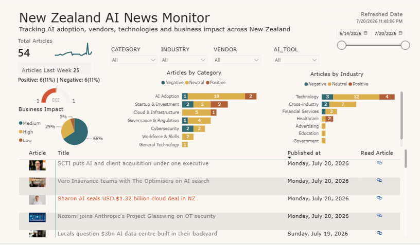
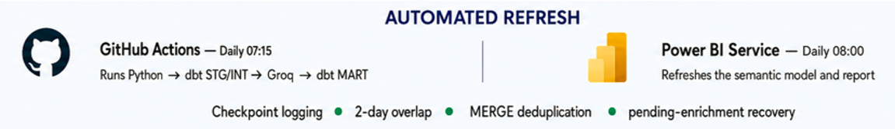
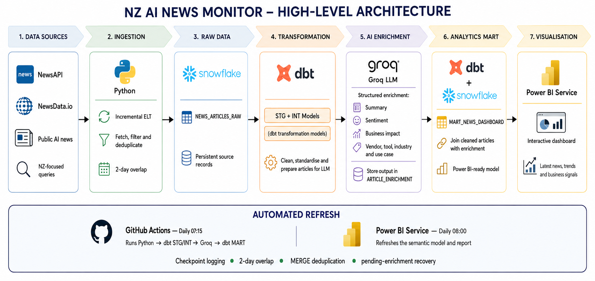

# NZ AI News Monitor
**A Data Engineering & Business Intelligence solution for monitoring AI news in New Zealand.**
<p align="left">


</p>

#### Min Long (Lucy)
Data Analyst | Analytics Engineer | BI Developer
- LinkedIn: https://www.linkedin.com/in/<your-linkedin>
- GitHub: https://github.com/<your-github-username>
---



## 📖 Project Overview

AI is evolving rapidly, making it difficult for businesses to keep up with the latest developments and understand their potential impact.

The NZ AI News Monitor automatically collects, filters, enriches, and visualises AI news from multiple online sources, providing insights into AI trends, business impact, industry adoption, and market sentiment.

---

# ⭐ Why This Project?

This project demonstrates the workflow commonly used by Data Engineers, Analytics Engineers, and BI teams to transform raw data into actionable business insights.

- Data Engineering
- Cloud Data Warehousing
- ELT Pipeline Design
- Incremental Processing
- AI Integration
- Data Quality Testing
- Business Intelligence
- Dashboard Development
- Version Control

---

## ❓ Business Questions

- What are the latest AI trends in New Zealand?
- Which vendors and AI tools receive the most attention?
- Which industries are adopting AI?
- What is the business impact and sentiment of AI news?
- How are AI developments changing over time?
---

## 💡 Solution

The project implements a complete cloud-based analytics pipeline that:

- Collects AI news from multiple APIs using Python
- Incrementally loads new articles into Snowflake
- Transforms and validates data using dbt
- Enriches articles with an LLM to generate business insights
- Visualises business insights in an interactive Power BI dashboard

---

## ✨ Key Strengths

- **Modular** – Independent pipeline stages for easy maintenance and extension.
- **Scalable** – Built on Snowflake to support cloud-scale data processing.
- **Reusable** – Easily adapted to monitor any news topic.
- **Cost-efficient** – Incremental loading and selective LLM enrichment reduce processing costs.


---

# 🚀 Key Features

- 🌐 Multi-source API ingestion
- 🔄 Incremental ELT pipeline
- ❄️ Layered Snowflake data warehouse
- 🏗️ dbt data modelling & testing
- 🤖 LLM-powered news enrichment
- 📊 Interactive Power BI dashboard
- ⚡ Automated data quality & deduplication

---

# 🛠 Technology Stack

| Layer | Technology | Purpose |
|--------|------------|---------|
| Programming | Python | API integration, orchestration, and ELT |
| APIs | NewsAPI, NewsData.io | AI news collection |
| Data Warehouse | Snowflake | Cloud data warehouse |
| Transformation | dbt | Data modelling and testing |
| AI | Groq LLM | Article enrichment |
| Analytics | Power BI | Dashboard and reporting |
| Version Control | Git & GitHub | Source code management |
| Configuration | dotenv | Secure credential management |

---


# ❄ Snowflake Data Warehouse

The project uses **Snowflake** as a cloud data warehouse with a layered ELT architecture. Data is ingested into the **RAW** layer, transformed using **dbt**, enriched with **Groq LLM**, and published to a business-ready **MART** for Power BI reporting.

```
News APIs
    │
    ▼
RAW.NEWS_ARTICLES_LANDING
    │
    ▼
RAW.NEWS_ARTICLES_RAW
    │
    ▼
DBT_DEV.STG_NEWS_ARTICLES
    │
    ▼
DBT_DEV.INT_NEWS_READY_FOR_LLM
    │
    ├────────► Groq LLM
    │              │
    │              ▼
    │     RAW.ARTICLE_ENRICHMENT
    └──────────────┘
           │
           ▼
MART.MART_NEWS_DASHBOARD
           │
           ▼
        Power BI
```

| Layer | Purpose |
|-------|---------|
| **RAW** | Stores landing data, raw articles, AI enrichment results, and pipeline logs. |
| **DBT_DEV** | Cleans and transforms raw data into reusable staging and intermediate models. |
| **MART** | Publishes the final business-ready table for Power BI dashboards. |

This layered design separates ingestion, transformation, AI enrichment, and reporting, providing a scalable and maintainable analytics workflow following modern **Bronze → Silver → Gold** architecture principles.

---

# 🔄 Incremental Pipeline

The pipeline processes only new articles, reducing API usage, LLM costs, and Snowflake compute.

```text
Read Last Load
      │
      ▼
Fetch New Articles
      │
      ▼
Remove Duplicates
      │
      ▼
Load to RAW
      │
      ▼
dbt Models
      │
      ▼
LLM Enrichment
      │
      ▼
Power BI
```

**Key Features**

- Incremental loading with a **2-day overlap**
- Duplicate detection across data sources
- LLM enrichment for new articles only
- Automated dbt data quality tests

---

# 🤖 LLM Enrichment

New articles are enriched with Groq LLM to generate structured business insights, including:

- Summary
- Business Impact
- Sentiment
- Vendor & AI Tool
- Industry
- Use Case

These fields enable filtering and business analysis in Power BI.

---

# 🧪 Data Quality

Automated **dbt** tests validate:

- Unique article keys
- Required fields
- Accepted values
- Relevance flags

---

# 📊 Power BI Dashboard

The dashboard provides interactive insights into AI adoption and trends in New Zealand.

**Key Visuals**

- 📰 Latest AI News
- 📈 Vendor Trends
- 🤖 AI Tools
- 🏢 Industry Adoption
- 💼 Business Impact
- 😊 Sentiment Analysis

The dashboard enables users to explore AI developments by vendor, tool, industry, business impact, and sentiment.

---

# 💼 Skills Demonstrated

- Python
- SQL
- Snowflake
- dbt
- API Integration
- ELT Pipelines
- Data Modelling
- LLM Integration
- Power BI
- Business Intelligence

---

# 🚀 Future Enhancements

- GitHub Actions automation
- Additional news sources
- RAG & vector search
- Advanced Power BI dashboards

---

# 📂 Project Structure

```text
NZ-AI-News-Monitor/
│
├── ai_news_dbt/
│   ├── models/
│   │   ├── staging/
│   │   ├── intermediate/
│   │   └── marts/
│   ├── macros/
│   ├── tests/
│   ├── dbt_project.yml
│   └── packages.yml
│
├── src/
│   ├── config/
│   ├── ingestion/
│   ├── enrichment/
│   └── utils/
│
├── docs/
│   ├── architecture.png
│   └── dashboard.png
│
├── logs/
├── main.py
├── requirements.txt
├── .env.example
├── .gitignore
├── README.md
└── LICENSE

# ▶️ How to Run

1. **Clone the repository**

```bash
git clone https://github.com/<your-username>/NZ-AI-News-Monitor.git
cd NZ-AI-News-Monitor
```

2. **Install dependencies**

```bash
pip install -r requirements.txt
```

3. **Configure credentials**

Create a `.env` file and add your Snowflake, NewsAPI, NewsData.io, and Groq API credentials.

4. **Configure dbt**

```bash
cd ai_news_dbt
dbt debug
```

5. **Run the pipeline**

```bash
python main.py
```

6. **Refresh Power BI**

Open the Power BI report and refresh the data to view the latest insights.

> **Note:** The pipeline uses incremental loading, so only new articles are processed during each run.

# 💡 Lessons Learned

This project strengthened my skills in:

- Designing scalable incremental ELT pipelines
- Building layered data warehouses with Snowflake and dbt
- Integrating LLMs into analytics workflows
- Delivering reliable, business-ready dashboards

---

# 📄 License

Released under the MIT License.

---

# 🎯 Acknowledgements

Built with **Python**, **Snowflake**, **dbt**, **Groq**, **NewsAPI**, **NewsData.io**, and **Power BI**.